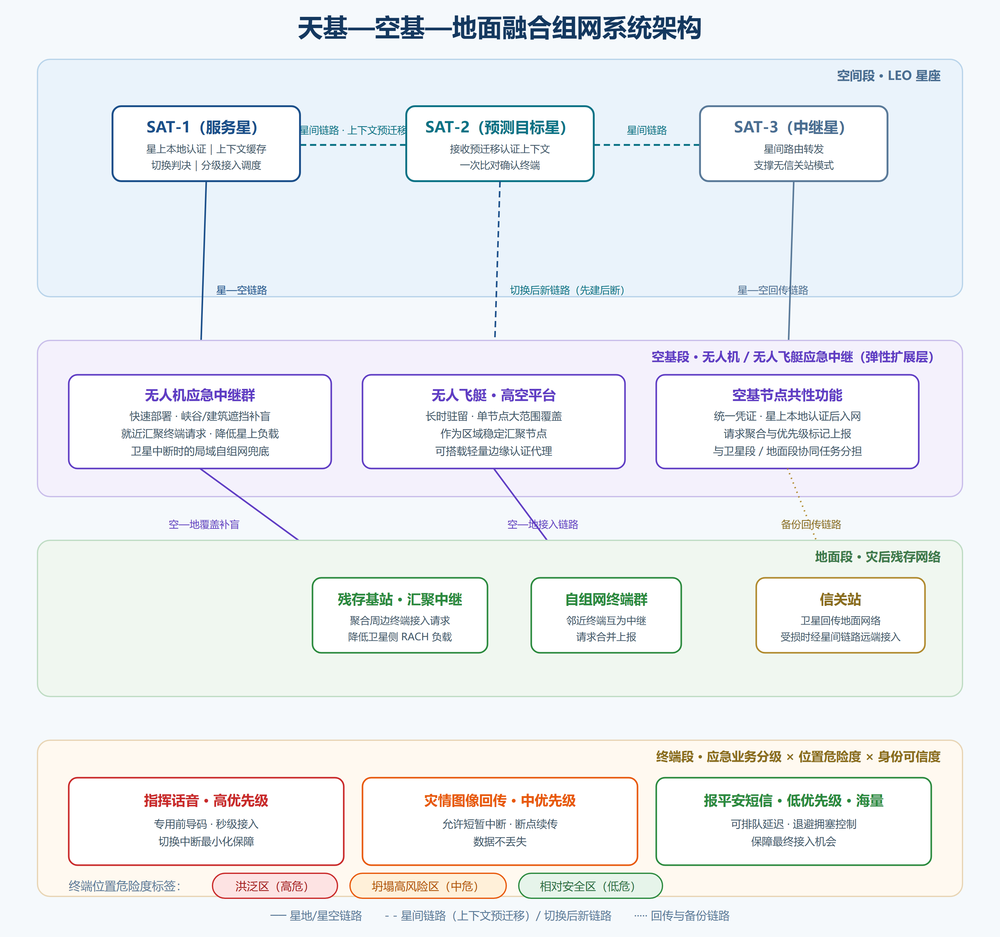
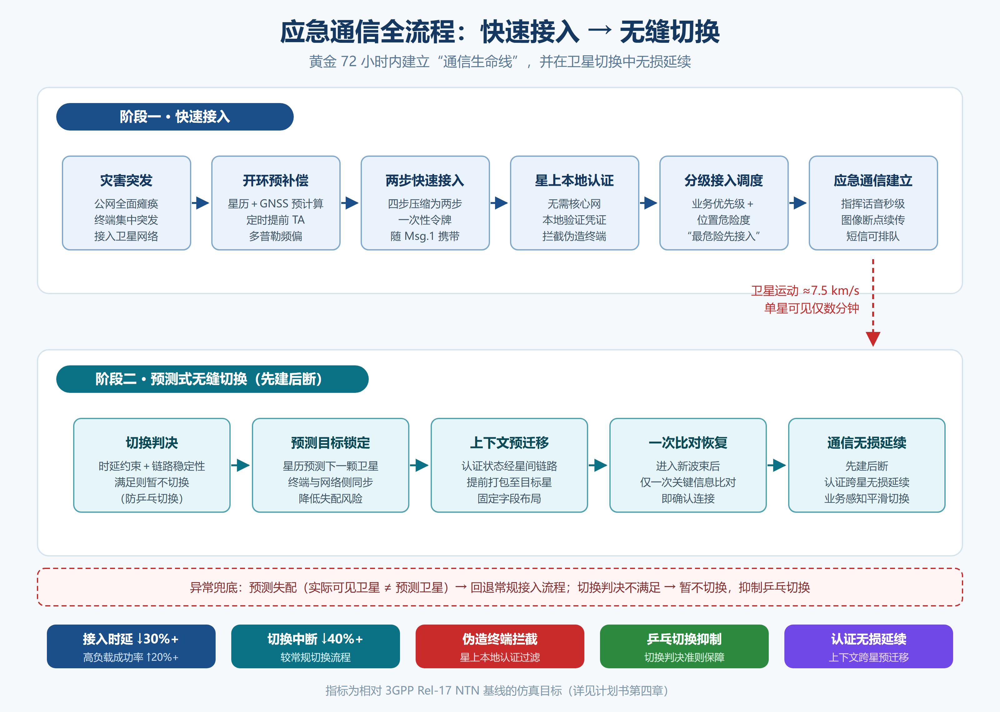
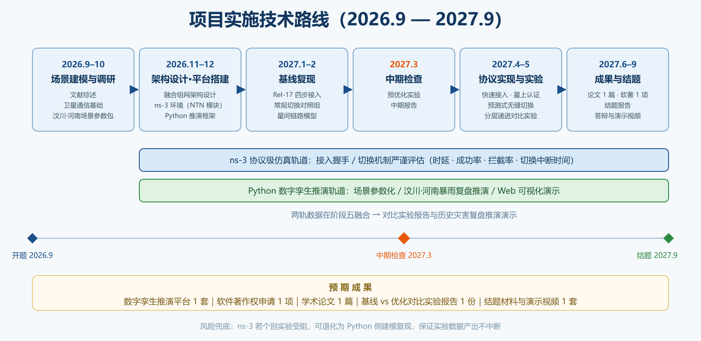
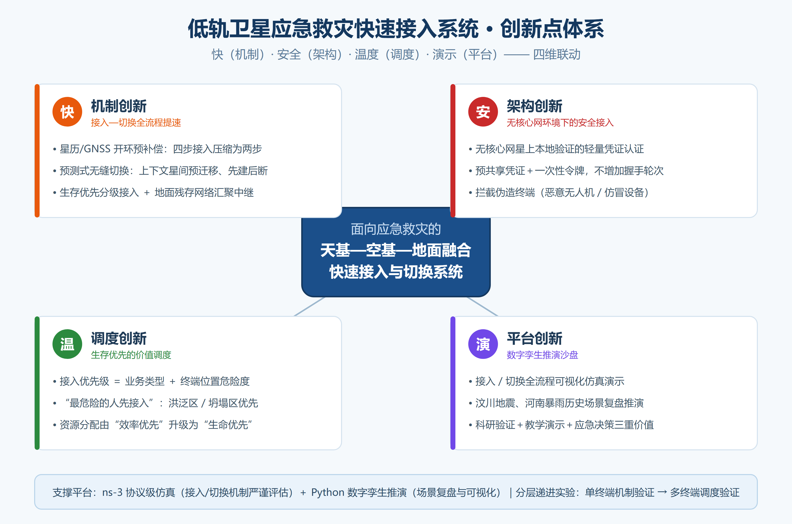

> 本文档由 `大创计划书初稿_低轨卫星应急救灾快速接入系统.docx` 自动转换为 Markdown，原始 docx 保留于仓库根目录。正文配图存于 `docs/assets/`。转换仅做格式迁移，未改动内容。

大学生创新创业训练计划项目

计 划 书

（初稿）

项目名称：面向应急救灾的低轨卫星—地面融合组网快速接入系统

项目负责人：庄泽宇

指导教师：乔塨哲

二〇二六年八月

# 一、项目基本信息

| 项目 | 内容 |
| --- | --- |
| 项目名称 | 面向应急救灾的低轨卫星—地面融合组网快速接入系统 |
| 项目类型 | 创新训练项目 |
| 所属学科门类 | 信息与通信工程 / 网络空间安全（交叉） |
| 项目负责人 | 庄泽宇 |
| 技术总负责人 | 姚世宸 |
| 团队成员 | 庄泽宇（队长）、姚世宸（技术总负责）、其他成员 5 人（待定），含指导教师共 8 人 |
| 指导教师 | 乔塨哲 |
| 项目周期 | 2026 年 9 月 — 2027 年 9 月（暂定一年） |
| 实施方式 | 基于仿真平台的全流程模拟与演示（不含真实卫星硬件） |

# 二、项目背景与意义

## 2.1 现实痛点

地震、山洪等重大自然灾害发生时，地面公网（基站、光缆、骨干网）通常在第一时间全面瘫痪：

- 汶川地震：震区通信中断长达 30 余小时，救援指挥严重受阻；

- 2021 年河南特大暴雨：部分城市公网中断，民众被困无法求救；

- 2023 年甘肃积石山地震：灾区一度成为“通信孤岛”。

灾后黄金 72 小时内，救援指挥、灾情上报、人员搜救都高度依赖通信保障。现有应急通信手段存在明显不足：

| 现有手段 | 主要缺陷 |
| --- | --- |
| 应急通信车 / 临时基站 | 进灾区道路损毁时无法抵达，架设耗时以小时计 |
| 短波 / 超短波电台 | 带宽极低，只能传语音，无法承载图像、视频等灾情数据 |
| GEO 卫星电话（天通等） | 时延高（约 500ms）、终端昂贵、并发容量小 |

## 2.2 低轨卫星带来的机遇

低轨（LEO）卫星星座轨道高度约 500~2000 km，相比 GEO 具有天然优势：

- 时延低：单跳传播时延约 20~50ms，可支撑准实时双向通信；

- 覆盖广：星座全球无缝覆盖，不受地面道路、光缆条件限制；

- 容量大：多波束、多星协同可支撑海量终端接入；

- 产业成熟：Starlink 已商用并支持手机直连，我国“星网 GW 星座”“千帆星座”正加速组网，3GPP Rel-17 已将非地面网络（NTN）纳入 5G 标准体系。

## 2.3 核心科学问题

灾害场景下，海量应急终端在公网瘫痪后集中、突发地试图接入卫星网络，传统随机接入流程面临四个瓶颈：

- 接入时延长：LEO 卫星高速运动（约 7.5 km/s），终端需完成波束扫描、上行同步（定时提前）、频偏校正（多普勒补偿）等多轮握手，灾害场景下信令拥塞进一步放大时延；同时单颗卫星对地面终端的可见时间通常仅数分钟，接入建立后不久即面临卫星切换，切换中断与重建开销进一步累积端到端时延；

- 接入成功率低：突发海量接入请求造成随机接入信道（RACH）冲突风暴；

- 接入安全性弱：应急接入信道公开暴露，缺乏身份认证环节，伪造终端（如恶意无人机、仿冒终端）可轻易占用稀缺接入资源，进一步挤占真实灾民的接入机会；切换过程中认证状态的重建同样存在被仿冒利用的风险；

- 星地融合组网困难：灾后残存的地面网络（个别存活基站、自组网终端）与卫星网络缺乏统一协调机制，资源利用效率低。

本项目聚焦“快速接入、无缝切换、安全可信”这一核心环节，研究面向应急救灾场景的低轨卫星—地面融合组网架构与安全快速接入及切换协议（性能优化 + 身份认证），通过仿真平台完成验证与演示。

## 2.4 项目意义

- 应用价值：为灾后“通信生命线”提供低成本、快部署的技术方案，服务于国家应急通信体系建设；

- 学术价值：面向“冷启动+突发拥塞”这一特殊场景的接入协议优化，是 NTN 研究中相对新颖的切入点；

- 人才培养：团队系统训练卫星通信、协议设计、网络仿真等核心能力，为后续“互联网+”、“挑战杯”等竞赛积累项目基础。

# 三、国内外研究现状

## 3.1 工程与产业界

| 方向 | 代表进展 |
| --- | --- |
| 国外商用星座 | Starlink 已服务数百万用户，2024 年起支持手机直连卫星（Direct to Cell） |
| 国内星座 | 中国星网 GW 星座、上海垣信“千帆星座”批量组网发射中 |
| 标准化 | 3GPP Rel-17 冻结 NTN 标准（含 LEO 场景），Rel-18/19 持续演进；CCSA 已立项多项 NTN 行标 |

## 3.2 学术研究热点

- 随机接入协议优化：S-ALOHA → CRDSA（竞争重传分时隙）→ NDMA（碰撞分解多址），学术界持续研究高负载下的接入吞吐与碰撞消除；

- 上行同步加速：利用卫星星历 + 终端 GNSS 位置预计算定时提前量（TA）与多普勒频偏，将开环预补偿引入接入流程，减少握手轮次；

- 波束管理与移动性：LEO 卫星波束高速扫过地面，切换频繁，快速波束选择/切换是热点；

- 应急通信场景：已有研究关注 DTN（延迟容忍网络）、空中平台（系留气球、无人机）应急组网，但“LEO 星座 + 地面残存网络融合 + 突发海量快速接入”的系统性研究仍较少，这正是本项目的切入点；

- 接入安全：5G/NTN 体系中的认证（如 5G-AKA）均在接入完成后执行，握手阶段的轻量级认证研究较少；灾害场景下应急信道公开暴露，防伪造终端接入具有强现实需求；

- 空天地一体化弹性组网：将无人机、飞艇等空基平台与卫星、地面网络统一纳管的协同架构正在成为主流方向。乔塨哲等提出“星空地”三层协同弹性架构，把无人机与飞艇同备份卫星一并纳入备份节点池，并设计故障分级检测与自愈重构机制，将网络数据包交付率由 82.4% 提升至 97.1%（《航空学报》2026）；这为本项目引入空基应急中继提供了直接的架构参考；

- 跨域轻量认证：低空无人机跨域作业面临身份管理难题，传统集中式 CA 存在单点故障，联盟链跨域认证与动态身份变换（假名）技术提供了“去中心化信任 + 可验证匿名”的思路。乔塨哲等提出基于联盟链的无人机跨域认证与轨迹隐私保护方案（IEEE IoT Journal，2025），其“无中心依赖、凭证可验证、身份动态可变”的设计思想，与本项目“无核心网环境下的轻量可信接入”需求同源。

## 3.3 前期研究基础（指导教师团队相关成果）

本项目指导教师乔塨哲团队在卫星网络弹性组网与低空无人系统安全认证两个方向均已形成可查证的学术积累，与本项目高度对口，可为方案设计、仿真建模与论文撰写提供直接指导：

| 成果 | 对本项目的支撑点 |
| --- | --- |
| ① 面向单粒子效应的卫星网络弹性组网及重构方法（乔塨哲、杨盘隆、叶彤、姚世宸、付道勇），《航空学报》2026，47(18): 532929 | ① 提供“天基—空基—地面”三层协同架构范式，明确无人机、飞艇可作为空基备份/中继节点；② 提供备份节点池与风险感知的建模思路；③ 验证 STK + NS-3 联合仿真技术路线可行（与本项目 ns-3 选型一致）；④ 技术总负责人姚世宸为该论文作者之一，已具备卫星网络仿真与重构算法经验 |
| ② A Blockchain-Based Cross-Domain Authentication and Flight Trajectory Privacy Protection Scheme for UAV Networks（Gongzhe Qiao, Panlong Yang, Tong Ye, Feiyu Han），IEEE IoT Journal, 2025 | ① 提供跨域轻量认证与密钥协商的方法参考；② “动态身份变换（假名）”思想可直接移植为本项目终端/空基节点的动态匿名标识，兼顾身份真实性与位置隐私；③ 其对抗模型（Dolev-Yao：窃听/重放/伪造/篡改）为本项目伪造终端攻击仿真提供威胁建模依据 |

说明：上述成果属于指导教师及团队成员的既有研究，本项目在其基础上面向应急救灾场景做场景化改造与教学级仿真验证（而非重复其工作）：弹性架构思想下沉为“空基应急中继扩展层”，跨域认证思想下沉为“星上本地验证的轻量凭证 + 动态匿名标识”，工作量控制在本科团队一年内可完成的范围。

# 四、研究目标

## 4.1 总目标

面向应急救灾场景，设计一套低轨卫星—地面融合组网架构与安全快速接入与切换协议，使灾后终端首次接入卫星网络的时延较标准 NTN 随机接入流程显著降低（仿真目标：接入时延降低 30% 以上、高负载下接入成功率提升 20% 以上、切换中断时间较常规切换流程降低 40% 以上），同时在接入握手中嵌入轻量级身份认证机制，显著提高伪造终端的接入难度，并实现认证状态在卫星切换过程中的无损延续，在自主搭建的数字孪生推演平台上完成全流程演示与历史灾害场景复盘。

## 4.2 分目标

- 建立灾害场景与应急业务的数学模型（终端分布、突发强度、业务类型、终端位置危险度）；

- 完成融合组网架构设计（卫星接入链路 + 空基应急中继 + 地面残存网络协同汇聚）；

- 提出并仿真验证快速接入握手协议优化方案（预补偿、拥塞控制、生存优先分级接入）；

- 提出预测式无缝切换机制：利用卫星运动可预测性，将认证状态等关键上下文经星间链路提前迁移至预测目标卫星，实现“先建后断”的一次比对快速切换；

- 设计无核心网环境下星上本地验证的轻量级身份认证机制，实现“快速接入”与“安全接入”的协同优化，并仿真评估其对伪造终端（恶意无人机、仿冒终端）的防御效果；

- 开发可视化仿真演示平台，支持历史灾害场景复盘推演，产出可复现的对比实验数据。

# 五、研究内容（五大模块）

### 模块一：应急场景与业务建模

- 灾害类型（地震/山洪）→ 通信设施损毁模型 → 终端分布与突发接入模型；

- 应急业务分级：指挥话音（高优先级）、灾情图像回传（中）、报平安短信（低、海量）；

- 终端位置危险度建模：结合灾害类型划分风险区域（洪泛区/坍塌高风险区/相对安全区），形成终端级危险度标签，为“生存优先”接入调度提供输入。

### 模块二：天基—空基—地面融合组网架构设计

借鉴指导教师团队“星空地”协同弹性架构成果，将原“星—地”两层架构扩展为天基—空基—地面三层融合架构：

- 天基段（LEO 星座）：星地链路（终端—卫星）、星间链路（卫星—卫星）、回传链路（卫星—信关站）三链路协同；承担广域覆盖、星上本地认证、切换判决与分级接入调度；

- 空基段（无人机 / 无人飞艇，弹性扩展层）：无人机应急中继群负责快速部署、局部补盲（峡谷、建筑遮挡、室内等卫星信号难以直达区域）；无人飞艇/高空平台长时驻留、单节点大范围覆盖，作为区域稳定汇聚节点。空基节点承担三项共性职责：① 就近汇聚终端接入请求，进一步降低卫星侧 RACH 负载；② 卫星链路临时不可用时提供局域自组网兜底；③ 与卫星段/地面段协同进行任务分担与备份接管；

- 地面段（灾后残存网络）：灾后存活基站、手持终端自组网作为“汇聚中继”，聚合周边终端请求统一接入；无信关站模式（灾区上空卫星经星间链路路由至远处信关站）的可行性分析；

- 空基段的工作量边界（重要）：本项目不研究无人机编队控制、轨迹规划与飞行动力学（工作量大且非项目核心），空基段仅作为架构兼容层与仿真场景扩展——重点研究空基节点如何参与“接入请求的汇聚、优先级标记与协同认证”，在仿真中以可配置节点（数量/覆盖半径/驻留时长）形式建模，验证其对接入成功率与覆盖率的增益。该设计既回应了“空天地一体化”的架构完整性要求，又确保本科团队一年内可交付。

图 1  天基—空基—地面融合组网系统架构

### 模块三：安全快速接入握手协议优化（核心创新之一）

- 基线方案：复现 3GPP NTN 四步随机接入流程作为对照组；

- 优化方向一（减少握手轮次）：利用星历 + GNSS 位置的开环预补偿（定时提前、多普勒频偏），把四步接入压缩为两步接入；

- 优化方向二（生存优先的分级接入）：构建“业务优先级 + 终端位置危险度”的综合优先级函数，高优先级终端使用专用导频/前导码——既保障指挥通信秒级接入，也让身处高风险区域的被困人员优先获得接入机会（“最危险的人先接入”）；

- 优化方向三（拥塞控制）：接入强度感知的退避算法 + 地面汇聚中继的请求合并，抑制“接入风暴”；

- 优化方向四（无核心网的接入安全认证）：灾区地面核心网瘫痪，传统 5G-AKA 类认证流程不可用，本项目设计星上本地验证的轻量凭证认证机制——终端以预共享凭证 + 一次性令牌在接入消息中完成可验证的身份证明，由卫星载荷本地完成认证过滤（可选信道指纹辅助），使伪造终端（恶意无人机、仿冒设备）难以冒充合法终端占用接入资源；认证机制设计需兼顾“不增加握手轮次、不显著增加信令开销、星上计算轻量”三重约束，实现安全性与接入时延的联合优化；

- 优化方向四的深化设计（借鉴跨域认证思想）：参考联盟链跨域认证方案中“动态身份变换（假名）+ 域间凭证可验证”的设计思想，本项目为终端与空基节点引入动态可变匿名标识——每次接入轮换、与终端长期身份解耦，使攻击者既无法仿冒，也无法通过截获信令长期跟踪特定终端（对救灾人员的行动安全同样有意义）；凭证采用“预分发凭证集 + 一次性令牌”，星上仅做本地比对验证。明确不引入区块链与共识机制：链上共识的计算与存储开销违背“星上轻量化”约束，本项目只借鉴其“去中心化信任、身份可验证、标识可轮换”的思想内核，不搬运其实现；

- 评估指标：平均/95% 分位接入时延、接入成功率、RACH 吞吐量、伪造终端接入拦截率、认证引入的额外时延与开销、高危区域终端接入保障效果。

### 模块四：预测式无缝切换机制（核心创新之二）

LEO 卫星运动规律可由星历精确预测，这是地面网络移动性管理所不具备的天然优势。本项目利用该优势将“被动等待切换”变为“主动预备切换”：

- 切换预测与目标锁定：基于星历与终端位置预测下一颗可见卫星，提前锁定切换目标，避免切换时重新扫星选星的开销；终端与网络侧对预测结果保持同步，降低“实际可见卫星与预测卫星不一致”的失配风险；

- 认证上下文预迁移（先建后断）：当前服务卫星在切换发生前，将终端的认证状态、接入上下文等关键信息经星间链路提前打包迁移至预测目标卫星；终端进入新卫星波束后仅需一次关键信息比对即可快速确认连接并恢复通信，避免重新执行完整接入与认证流程；

- 信令格式规范化：切换相关消息采用固定字段布局——关键信息（终端标识、认证凭证摘要、上下文序号）的位置与内容格式保持不变，支持新卫星侧快速定位与比对；

- 切换判决准则：综合评估当前链路是否满足业务时延约束、链路质量是否稳定（信噪比/丢包趋势）等因素判决“是否切换”——当前链路仍满足约束则暂不切换，避免不必要的乒乓切换；不满足则立即触发预备切换流程；

- 业务感知的平滑切换：按业务传输需求差异化处理切换期间的数据承载——指挥话音类业务以切换中断最小化为目标，灾情图像类业务允许短暂中断但保证数据不丢（断点续传），报平安短信类业务可容忍排队延迟；

- 约束条件：星上计算与存储资源有限，切换机制设计遵循轻量化原则，不在星上引入数据预处理类重负载功能；

- 评估指标：切换中断时间、切换总时延、切换成功率、乒乓切换率、预测失配率、不同业务类型在切换过程中的性能保持度。

图 2  快速接入与预测式无缝切换全流程

### 模块五：仿真平台与数字孪生推演系统

- 双平台架构：底层协议级仿真采用 ns-3（含卫星/NTN 模块）完成接入握手、切换机制的严谨性能评估（时延/成功率/拦截率/切换中断时间）；上层自研 Python 推演系统（卫星轨道模型、灾害场景参数化、结果解析）负责数字孪生推演与可视化；

- 可视化前端：展示星座运行、波束覆盖、终端接入过程、卫星切换事件与时延统计的动态画面；

- 分层递进实验设计：第一阶段以单终端/小规模终端验证接入与切换机制的正确性；第二阶段扩展多终端场景，验证生存优先分级调度与拥塞控制策略的有效性——分层设计控制整体工作量，同时保留多终端场景以支撑调度类创新点的实验对账；

- 历史灾害复盘推演：内置汶川地震、河南特大暴雨等真实灾害的场景参数包（终端分布、公网瘫痪范围、接入突发强度），支持推演“若当时部署本方案，通信恢复会怎样”的对比复盘，形成决策参考；

- 支持参数可配置（卫星数量/轨道高度/终端规模/突发强度/空基节点数量与部署方式），一键输出对比实验报告；

- 空基增益专项实验：在灾害场景参数包中对比“仅卫星直连 / 卫星+地面汇聚 / 卫星+地面汇聚+空基中继”三种配置下的覆盖率、接入成功率与平均接入时延，量化空基段的边际收益，为空基段的定位给出数据支撑（该实验以参数配置为主，实现成本低、展示效果好）。

# 六、技术路线与实施方案

文献调研与场景建模（2026.9-10）

↓

融合组网架构设计 + 仿真平台框架搭建（ns-3 环境与 Python 推演框架）（2026.11-12）

↓

NTN 标准接入流程基线复现（2027.1-2）→ 中期检查（2027.3）

↓

快速接入与安全认证协议设计实现 → 预测式无缝切换机制实现 → 对比实验（含伪造终端攻击仿真与切换场景实验）→ 迭代优化（2027.3-5）

↓

论文/软著撰写、结题答辩与演示（2027.6-9）

图 3  技术路线与进度安排

关键技术选型（综合指导教师与技术总负责人意见后的确定方案）：

| 技术点 | 备选方案 | 选择 | 理由 |
| --- | --- | --- | --- |
| 仿真内核 | NS-3 / OMNeT++ / MATLAB / Python 自研 | ns-3 + Python 自研双轨 | 指导教师确认仿真平台选型不限；协议级仿真（接入握手、切换机制）对严谨性要求高，ns-3 为业界标准工具且具备卫星/NTN 扩展模块；上层数字孪生推演、灾害场景复盘与可视化采用 Python 自研，开发效率高、演示效果好——两轨分工各取所长 |
| 卫星轨道 | 开源 TLE + SGP4 | 简化 Walker 星座模型 + 可选真实星历 | 演示以趋势正确性为主，避免陷入轨道力学细节 |
| 协议基线 | 3GPP Rel-17 NTN 随机接入 | Rel-17 四步接入流程复现（对比参考 Rel-18 演进方向） | 标准化、有据可依，对照组可信 |
| 切换机制 | 常规硬切换 / 条件切换（CHO）/ 预测式先建后断 | 预测式先建后断切换（认证上下文星间预迁移） | LEO 卫星运动可预测是差异化优势；预迁移避免重新执行完整接入认证，切换中断最小化 |
| 安全认证 | 5G-AKA（依赖核心网）/ 预共享密钥挑战应答 / 物理层信道指纹 / 证书体系 | 星上本地验证的轻量凭证认证（预共享凭证 + 一次性令牌，可选信道指纹辅助） | 灾区无地面核心网、5G-AKA 不可用；星上本地验证无需回传核心网；轻量方案可嵌入现有握手消息、不增加握手轮次（指导教师建议方向） |
| 可视化 | PyQt / Web（ECharts） | Web 前端 | 跨平台、演示效果好、可录制结题视频 |
| 轨道数据 | 纯数学轨道模型 / STK 导出 | 简化 Walker 星座模型为主，条件具备时可导入 STK 轨道数据 | 指导教师团队已在 STK + NS-3 联合仿真上验证可行（铱星星座场景），本项目以轻量模型为主，STK 作为可选进阶 |

# 七、项目创新点

- 机制创新（快）：提出“星历/GNSS 辅助的开环预补偿 + 预测式无缝切换 + 生存优先分级接入 + 地面残存网络汇聚中继”的快速接入与切换方案——特别是利用卫星运动可预测性实现认证上下文星间预迁移的“先建后断”切换，将“接入快”延伸为“接入—切换全流程快”，系统性压缩端到端通信建立时延；

- 安全架构创新（安全）：直面“灾区核心网瘫痪、传统 5G 认证不可用”这一特殊约束，设计星上本地验证的轻量凭证认证机制，在不增加握手轮次的前提下拦截伪造终端——区别于传统“先接入、后认证”且依赖核心网的 5G/NTN 体系，契合网络空间安全学科背景；

- 价值调度创新（温度）：将应急管理的“生存价值”维度引入接入调度——接入优先级由业务类型与终端位置危险度共同决定，让“最危险的人先接入”，实现应急通信资源分配从“效率优先”到“生命优先”的理念升级；

- 平台创新（演示）：仿真平台升级为“应急通信数字孪生推演沙盘”，支持汶川地震、河南暴雨等历史灾害场景复盘推演，兼具科研验证、教学演示与应急决策参考三重价值。

图 4  项目四维创新点体系

说明：天基—空基—地面三层融合属于架构完整性设计（回应空天地一体化趋势、依托指导教师既有成果），不单列为第五个创新点，以避免创新点堆砌、稀释主线；其核心价值仍落在上述“快 / 安全 / 温度 / 演示”四条主线上。

# 八、进度安排

| 阶段 | 时间 | 主要任务 | 里程碑/交付物 |
| --- | --- | --- | --- |
| 一 | 2026.9–2026.10 | 完成报名；文献综述；卫星通信基础学习；灾害场景建模与历史灾害（汶川、河南暴雨）场景参数整理 | 文献综述报告、场景模型文档、灾害场景参数包 |
| 二 | 2026.11–2026.12 | 融合组网架构设计；ns-3 仿真环境搭建（含卫星/NTN 模块）；Python 推演框架（轨道模型+事件调度+结果解析） | 架构设计文档、仿真平台 v0.1（双轨框架） |
| 三 | 2027.1–2027.2 | NTN 四步接入基线复现；信道与移动性模型完善；切换场景与星间链路模型搭建 | 基线仿真数据（接入+常规切换对照组） |
| 四 | 2027.3 | 中期检查；预优化实验 | 中期报告 |
| 五 | 2027.4–2027.5 | 快速接入协议实现与迭代；星上本地认证实现与攻击仿真（伪造终端/无人机接入拦截实验）；预测式无缝切换机制实现与切换场景对比实验；生存优先调度策略实验（多终端分层实验第二阶段）；历史灾害复盘推演演示场景制作；可视化演示界面 | 优化方案代码与实验数据、安全机制评估报告、切换机制评估报告、复盘推演演示场景包、演示 Demo |
| 六 | 2027.6–2027.9 | 论文撰写、软著申请、结题答辩 | 论文 1 篇、软著申请 1 项、结题报告、演示视频 |

# 九、团队分工

| 成员 | 角色 | 职责 |
| --- | --- | --- |
| 庄泽宇 | 队长 / 项目负责人 | 总体架构设计与思路创新；赛程规划与任务分解；计划书、中期/结题材料撰写；答辩主讲；对外协调（导师、学院） |
| 姚世宸 | 技术总负责人 | 接入协议、安全认证机制与预测式无缝切换机制方案设计；ns-3 仿真环境主导；关键技术难题攻关（与导师深度对接） |
| 成员 A（待定） | 仿真开发 | 卫星轨道模型与信道模型实现（ns-3 侧配置与扩展） |
| 成员 B（待定） | 仿真开发 | 接入与切换流程状态机实现、实验脚本编写 |
| 成员 C（待定） | 前端与演示 | 可视化界面开发、演示视频制作 |
| 成员 D（待定） | 测试与数据 | 实验执行、数据统计与对比图表输出 |
| 成员 E（待定） | 调研与文档 | 文献调研、资料整理、过程文档维护、会议记录 |
| 乔塨哲 | 指导教师 | 技术方向把关、方案评审、关键节点指导 |

分工原则：负责人（庄泽宇）承担全部管理与文档主笔，技术实现以姚世宸为核心，其余成员按模块领取明确交付物，任务颗粒度控制在 1~2 周可验收。

# 十、预期成果

| 成果类型 | 具体内容 | 数量 |
| --- | --- | --- |
| 仿真平台 | 低轨星地融合快速接入数字孪生推演系统（含可视化界面与历史灾害复盘场景包） | 1 套 |
| 软件著作权 | 应急卫星快速接入仿真平台软件 | 申请 1 项 |
| 学术成果 | 论文 1 篇（校内期刊/学术会议/普刊，视进度） | 1 篇 |
| 实验报告 | 基线 vs 优化方案对比实验数据集与分析报告 | 1 份 |
| 结题材料 | 结题报告、演示视频、全部源码与文档 | 1 套 |

# 十一、经费预算（总额 5000 元，可按立项级别调整）

| 科目 | 金额（元） | 用途说明 |
| --- | --- | --- |
| 资料费 | 500 | 文献获取、标准文档（3GPP NTN 系列）、专业书籍 |
| 云计算/服务器租用 | 1200 | 大规模仿真实验的算力租用、演示平台部署 |
| 软件与工具费 | 800 | 绘图工具、软件著作权申请相关费用 |
| 调研差旅费 | 1000 | 需求调研、学术会议/竞赛差旅 |
| 论文版面费 | 1000 | 论文发表版面费（如投稿普刊/会议） |
| 打印装订与耗材 | 500 | 材料打印、结题材料装订 |

# 十二、风险分析与应对

| 风险 | 等级 | 应对措施 |
| --- | --- | --- |
| 技术门槛高，团队卫星通信基础薄弱 | 高 | ① 协议级仿真（ns-3）由技术总负责人主导并依托导师指导；② 采取 ns-3 + Python 双轨分工，上层推演与可视化用 Python 降低多数成员的参与门槛；③ 合理利用 AI 辅助编程，负责人负责需求定义与结果验收 |
| ns-3 学习曲线陡峭、改动接入流程源码门槛高 | 中 | ① 阶段二（2026.11-12）即开始环境搭建，预留充足学习时间；② 优先利用现成卫星/NTN 扩展模块，仅在参数与流程逻辑层做改动，避免深入源码底层；③ 若个别实验进度受阻，该部分可退化为 Python 侧建模复现，保证数据产出不中断 |
| 预测失配（实际可见卫星与预测卫星不一致） | 中 | 设计失配回退机制（回退到常规接入流程）；将预测失配率作为专门实验变量，用参数化实验刻画其影响并给出适用条件 |
| 优化方案性能提升不达预期 | 中 | 指标采用“相对基线的提升百分比”表述，弱化绝对值；接入、切换、调度、安全四个方向各自独立出实验结果，保证至少两个方向出效果 |
| 团队新建、磨合不足 | 中 | 任务颗粒化到 1~2 周交付物；每周例会同步进度；负责人统一管理里程碑 |
| 中期检查节点紧张 | 中 | 基线复现（阶段三）为硬节点，优先保障；可视化演示可先出简化版 |
| 空基段（无人机/飞艇）扩展导致工作量失控 | 中 | ① 明确工作量边界：不做编队控制与轨迹规划，仅建模为可配置中继/汇聚节点；② 空基段定位为“弹性扩展层”，若进度紧张可整体裁剪而不影响接入、认证、切换三条主线的交付；③ 空基增益专项实验以参数配置为主，成本可控 |
| 经费/算力不足 | 低 | 仿真为轻量级，普通笔记本 + 少量云算力即可满足；预算预留弹性 |

# 十三、可行性分析（摘要）

- 方案可行性：项目为纯仿真研究，不依赖真实卫星与硬件，投入可控；

- 技术可行性：基线方案遵循 3GPP Rel-17 NTN 标准流程，有公开文献与标准文档支撑；优化方向（预补偿、预测式无缝切换、生存优先分级接入、拥塞控制、星上本地化安全认证）均有学术先例或成熟构件可参考，属于“组合式创新”，适合本科团队在一年周期内完成；实验采用分层递进设计——先以单终端/小规模场景验证接入与切换机制正确性，再扩展多终端场景验证调度策略，工作量可控；生存优先调度与历史灾害复盘推演以策略设计与场景参数化为主，实现门槛可控而展示效果突出；团队来自网络空间安全学院，身份认证与安全机制设计恰为专业所长；

- 团队可行性：技术负责人长期跟随导师从事相关研究并已对切换机制、平台选型给出系统建议，且为指导教师团队卫星网络弹性组网论文（《航空学报》2026）作者之一，已具备卫星网络建模与仿真经验；负责人具备项目管理与文档撰写经验（曾负责大创项目全程并完成验收），安全认证与切换机制方向均已获指导教师/技术负责人确认；

- 指导可行性：指导教师团队在“卫星网络弹性组网”与“低空无人系统跨域认证”两个方向均有已发表成果，与本项目“空天地融合 + 无核心网轻量认证”两条主线一一对应，可提供从架构设计、仿真建模到论文写作的全流程指导，显著降低本科团队在陌生领域摸索的时间成本；

- 工具可行性：ns-3 为网络仿真领域标准工具、卫星/NTN 扩展模块成熟，Python 生态完善，AI 辅助编程可显著压缩开发周期，团队已具备相关使用经验。

# 附：主要参考文献

- 乔塨哲，杨盘隆，叶彤，姚世宸，付道勇．面向单粒子效应的卫星网络弹性组网及重构方法［J］．航空学报，2026，47(18)：532929．

- Qiao G Z, Yang P L, Ye T, Han F Y. A Blockchain-Based Cross-Domain Authentication and Flight Trajectory Privacy Protection Scheme for Unmanned Aerial Vehicle Networks［J］. IEEE Internet of Things Journal, 2025. DOI: 10.1109/JIOT.2025.3627629.

- Qiao G Z, Zhuang Y, Ye T. A Method for Analyzing the Impact of SEUs on Satellite Networks from the Perspective of Distributed Routing［J］. Ad Hoc Networks, 2024, 162: 103546.

- 3GPP TS 38.821. Solutions for NR to Support Non-Terrestrial Networks (NTN)［S］. Release 16/17.

- 3GPP TS 38.331. NR; Radio Resource Control (RRC) Protocol Specification（NTN 相关流程）［S］.

- 3GPP RP-234078. Study on NTN for Non-Terrestrial Networks（Release 18 演进方向）［R］.

其中 [1][2][3] 为指导教师乔塨哲及团队成员（含本项目技术总负责人姚世宸）已发表成果，构成本项目的前期研究基础。

初稿完成于 2026-08-30（四次修订）。二次修订回填指导教师（乔塨哲）意见：① 在接入握手中嵌入身份认证/安全性认证机制，升级为“无核心网星上本地验证的轻量凭证认证”；② 仿真平台选型不做限定。三次修订回填技术总负责人（姚世宸）意见：① 新增“预测式无缝切换机制”模块（切换预测与目标锁定、认证上下文星间预迁移/先建后断、信令格式规范化、切换判决准则、业务感知平滑切换、星上轻量化约束）；② 仿真平台确定为 ns-3（协议级仿真）+ Python（数字孪生推演）双轨架构；③ 实验设计采用分层递进：第一阶段单终端/小规模验证接入与切换机制正确性，第二阶段多终端场景验证生存优先分级调度与拥塞控制；④ 基线采用 3GPP Rel-17 NTN，对比参考 Rel-18 演进方向。创新点体系为“快（机制）+ 安全（架构）+ 温度（调度）+ 演示（平台）”四维，其中“快”由接入延伸为“接入—切换全流程”。四次修订依据指导教师提供的两篇参考文献（卫星弹性组网［1］、无人机跨域认证［2］）与“可结合无人机/飞艇”的建议：① 架构由“星—地两层”扩展为“天基—空基—地面三层融合”，新增空基段（无人机应急中继群 + 无人飞艇高空平台）作为弹性扩展层，并明确工作量边界（不做编队控制与轨迹规划）；② 新增 3.3 前期研究基础章节与参考文献，建立与指导教师既有成果的承接关系；③ 认证机制借鉴跨域认证的“动态身份变换”思想，引入动态可变匿名标识，并明确不引入区块链共识（违背星上轻量化约束）；④ 新增空基增益专项实验（三种配置对比量化边际收益）；⑤ 技术选型表补充轨道数据一项（STK 为可选进阶）；⑥ 风险与可行性章节补充空基扩边风险应对与指导可行性；⑦ 全文插入架构图、创新点图、流程图、技术路线图 4 张配图。待补充项：团队成员名单与学号、学校申报书模板套用。
